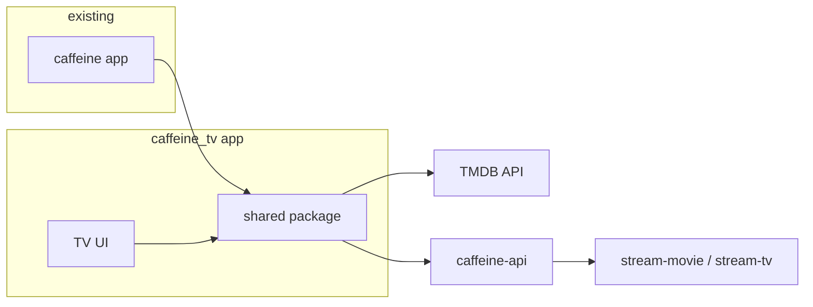

# Android TV Flutter App (caffeine_tv)

## Current state

- **caffeine**: Flutter app (phone/tablet only); Movies, TV, Discover, Profile; TMDB for catalog; [caffeine-api](c:\Users\cnieves\Desktop\Projects\caffeine-api) for streaming. Uses [caffeine_betterplayer](c:\Users\cnieves\Desktop\Projects\caffeine_betterplayer) for playback. Android TV / leanback support is removed so the app no longer appears on TV launchers.
- **caffeine-api**: No auth; `/config` for base URL and flags; scraper providers `vixsrc`, `vidsrc`, `vidzee` for movies/TV.

## Architecture

- **New project**: `caffeine_tv` (Flutter), Android TV-only (optional: exclude phone from store via manifest).
- **Shared package**: New Dart package (e.g. `caffeine_core` or `packages/caffeine_core`) used by both `caffeine` and `caffeine_tv` to avoid duplicating API and model logic.

## 1. Shared package (caffeine_core)

Create a package that both apps can depend on (e.g. under `caffeine/packages/caffeine_core` or a sibling repo).

- **API / config**
  - Base URL handling and `GET /config` (parse consumet_url, caffeine_api_url, tmdb_proxy, etc.).
  - TMDB: discover, popular, trending, top_rated, now_playing, upcoming, movie/TV detail, genres, search (reuse URL building from [lib/api/endpoints.dart](c:\Users\cnieves\Desktop\Projects\caffeine\lib\api\endpoints.dart)).
  - Caffeine-api: `GET /:provider/stream-movie?tmdbId=`, `GET /:provider/stream-tv?tmdbId=&season=&episode=` and optionally `GET /providers`, `GET /providers/status` (from [caffeine-api](c:\Users\cnieves\Desktop\Projects\caffeine-api) scraper routes).
- **Models**
  - Minimal DTOs for: movie list item, TV list item, movie detail, TV show + seasons/episodes, stream link (server, url, isM3U8, quality, subtitles) to match API responses and TMDB.
- **No UI** in the package; keep it pure data/network so the main app and TV app can each implement their own UI and state (Provider, Riverpod, etc.).

The existing [caffeine](c:\Users\cnieves\Desktop\Projects\caffeine) app can later be refactored to use this package (optional follow-up); for the first phase, only `caffeine_tv` is required to use it. If you prefer to avoid a shared package initially, the TV app can duplicate the needed endpoint and model code from caffeine and switch to the shared package when refactoring the main app.

## 2. New Flutter project: caffeine_tv

- **Location**: Sibling to `caffeine`, e.g. `caffeine_tv/`.
- **Dependencies**: `caffeine_core` (path or git), `caffeine_betterplayer` (path to existing [caffeine_betterplayer](c:\Users\cnieves\Desktop\Projects\caffeine_betterplayer)), plus typical (http/dio, provider or similar, cached_network_image). No GetX required unless you want parity with the main app.
- **Environment**: `.env` (or build-time config) for `TMDB_API_KEY`, `CAFFEINE_API_URL` (default: same as main app). Load config from `GET $CAFFEINE_API_URL/config` on startup.

**Android TV configuration**

- **AndroidManifest**: `uses-feature android:name="android.software.leanback" android:required="true"`, `android:banner="@drawable/tv_banner"` for the TV launcher (reuse or add banner asset in caffeine_tv), `LEANBACK_LAUNCHER` intent-filter; optionally set `android:required="false"` for `touchscreen` so the app is treated as TV-first.
- **build.gradle**: `minSdk` and `targetSdk` compatible with TV (e.g. 21+ for TV). No need for phone-specific permissions (e.g. fine location) in the TV build.

## 3. TV app UX (movies and TV only)

- **Navigation**: Top nav bar or left rail (Movies | TV | Search | Settings) with D-pad: focus moves between rail and content; no bottom tab bar that assumes touch.
- **Home / Movies**
  - Horizontal “rails” (rows): e.g. Popular, Trending, Top Rated, Now Playing, Upcoming, Genres. Each item focusable; focus ring or scale on selection.
  - Grid or list items: poster + title (and optional subtitle). Use `Focus` / `FocusTraversal` and `onKey` so that up/down moves between rows and left/right within a row (or use a package like `flutter_ttv` if you want structured focus groups).
- **Movie detail**
  - Full-screen backdrop, poster, title, overview, play button, optional “More like this”. Play triggers stream resolution and then playback.
- **TV**
  - Same rail-based browse; item opens **show detail** (seasons list). Selecting a season shows **episode list**. Selecting episode triggers stream resolution and playback.
- **Stream resolution**
  - Use caffeine_core to call caffeine-api `stream-movie` or `stream-tv` with a chosen provider (e.g. vixsrc). On success, pass the playback URL (and subtitles) to the player.
- **Playback**
  - Use `caffeine_betterplayer` (or the same player used in the main app) in a full-screen route; ensure D-pad back stops playback and returns to detail/list. No live streams in v1.

**Focus and keys**

- Ensure every interactive widget is focusable and has a visible focus state (e.g. border/scale).
- Handle D-pad: up/down/left/right for navigation; Enter/Select to activate; Back to go back.
- Avoid requiring touch or long-press for primary actions.

## 4. Auth for TV app

The TV app will use the **same Supabase project** as the main app ([caffeine/lib/provider/sign_in_provider.dart](c:\Users\cnieves\Desktop\Projects\caffeine\lib\provider\sign_in_provider.dart)) so users have one account and shared profiles, bookmarks, and watch history across phone and TV.

**TV-friendly flow (no keyboard):**

- **Pairing code**: On first launch (or when signed out), the TV app shows a "Sign in" screen with a short-lived **pairing code** (e.g. 6–8 characters) and instructions: "Go to [URL] or open Caffeine on your phone and enter this code."
- **Completing sign-in**: User opens a **pairing page** (web or in the existing phone app): enters the code and signs in with existing Supabase methods (email/password or Google). Backend associates the code with that user's session.
- **TV gets session**: TV app polls an endpoint (or uses realtime) until the code is linked, then receives Supabase access/refresh tokens and stores them (e.g. via Supabase client persistence). TV is then signed in as that user.

**Backend requirements:**

- A way to **create** a pairing code (TV calls e.g. `POST /tv/pair` or a Supabase Edge Function) and **exchange** it for a session (phone/pairing page calls e.g. `POST /tv/pair/confirm` with code + Supabase session or tokens). Options:
  - **Supabase Edge Functions** + a table (e.g. `tv_pairing_codes`: code, user_id, created_at, expires_at); TV creates row with code, polling reads user_id when set; pairing page updates row with user_id after sign-in and returns session to TV (or TV fetches session via secure endpoint).
  - Or a small **caffeine-api** route (if you prefer not to use Edge Functions): same idea—create code, confirm with auth, return tokens for TV.
- Pairing page: can be a simple static page (e.g. under caffeine-admin or a dedicated subdomain) that loads Supabase JS, shows code input, and on success tells backend to link code to current user; TV polls until linked and then fetches session.

**TV app behavior:**

- Gate main content (or show "Sign in to continue") until the user has completed pairing. Optional: allow browsing without sign-in and only require auth for play / continue watching / bookmarks.
- Persist Supabase session on TV (same as main app: refresh token, secure storage).
- Settings: "Sign out" to clear session and return to pairing screen.

**Reference:** Main app auth is in [caffeine/lib/provider/sign_in_provider.dart](c:\Users\cnieves\Desktop\Projects\caffeine\lib\provider\sign_in_provider.dart) and [caffeine/lib/screens/auth_screens/login_screen.dart](c:\Users\cnieves\Desktop\Projects\caffeine\lib\screens\auth_screens\login_screen.dart); Supabase is initialized in main with anon key from env.

## 5. Out of scope for v1

- **Live TV**: Not implemented initially; can be added later using the same caffeine-api daddylive routes and a live-specific screen. If you need “Continue watching” or bookmarks on TV, consider a TV-friendly flow (e.g. pairing code or link from phone) in a later phase; v1 can be anonymous or use a simple PIN if the backend supports it.

## 6. Implementation order

1. **Shared package**: Create `caffeine_core` with config client, TMDB URL builders (or minimal client), caffeine-api stream endpoints, and shared models.
2. **New project**: `flutter create` caffeine_tv, add Android TV manifest and gradle config, add dependency on `caffeine_core` and `caffeine_betterplayer`.
3. **Auth backend**: Add pairing flow (e.g. Supabase Edge Functions or caffeine-api routes): create code, confirm with user session, TV polls and receives Supabase session. Pairing page (web or in main app) for users to enter code and sign in.
4. **TV auth**: In caffeine_tv, Supabase init (same project/anon key); "Sign in" screen with pairing code + instructions; poll until code linked, then store session; gate content or key features on auth; Sign out in Settings.
5. **Config and API**: In TV app, load config from caffeine-api; use caffeine_core for TMDB catalog and stream links.
6. **TV shell**: Single main screen with top/left nav (Movies, TV, Search, Settings) and a content area; implement focus traversal.
7. **Movies**: Rails (Popular, Trending, etc.) and movie detail screen; play → resolve stream → open player.
8. **TV**: Rails for shows, show detail (seasons/episodes), episode play → resolve stream → open player.
9. **Search**: Optional simple search (TMDB search API via caffeine_core) with focusable results.
10. **Settings**: API URL override, language, Sign out.

## Key files to reference

| Purpose                | Location                                                                                                                                                                                                                                                                   |
| ---------------------- | -------------------------------------------------------------------------------------------------------------------------------------------------------------------------------------------------------------------------------------------------------------------------- |
| TMDB & stream URLs     | [caffeine/lib/api/endpoints.dart](c:\Users\cnieves\Desktop\Projects\caffeine\lib\api\endpoints.dart)                                                                                                                                                                       |
| Config fetch           | [caffeine/lib/utils/config_api.dart](c:\Users\cnieves\Desktop\Projects\caffeine\lib\utils\config_api.dart)                                                                                                                                                                 |
| API base / env         | [caffeine/lib/utils/constant.dart](c:\Users\cnieves\Desktop\Projects\caffeine\lib\utils\constant.dart)                                                                                                                                                                     |
| Stream loading (movie) | [caffeine/lib/video_providers/provider_loader.dart](c:\Users\cnieves\Desktop\Projects\caffeine\lib\video_providers\provider_loader.dart) (vixsrc/vidsrc/vidzee via Flix API)                                                                                               |
| Player usage           | [caffeine/lib/screens/player/player.dart](c:\Users\cnieves\Desktop\Projects\caffeine\lib\screens\player\player.dart), [caffeine_betterplayer](c:\Users\cnieves\Desktop\Projects\caffeine_betterplayer)                                                                     |
| TV manifest example    | Use caffeine_tv manifest; main app no longer uses leanback.                                                                                                                                                                                                                |
| Auth (Supabase)        | [caffeine/lib/provider/sign_in_provider.dart](c:\Users\cnieves\Desktop\Projects\caffeine\lib\provider\sign_in_provider.dart), [caffeine/lib/screens/auth_screens/login_screen.dart](c:\Users\cnieves\Desktop\Projects\caffeine\lib\screens\auth_screens\login_screen.dart) |

## 7. Remove leanback / Android TV from main app (caffeine)

So the main app is phone/tablet-only and does not appear on Android TV launchers, remove all leanback and TV-related code in the **caffeine** project only.

**7.1 Android manifest** — [caffeine/android/app/src/main/AndroidManifest.xml](c:\Users\cnieves\Desktop\Projects\caffeine\android\app\src\main\AndroidManifest.xml)

- Remove the two TV-related `<uses-feature>` lines:
  - `android.software.leanback` (required=false)
  - `android.hardware.touchscreen` (required=false)
- Remove `android:banner="@drawable/tv_banner"` from the `<application>` tag (main app is phone-only; banner not used there).
- In the main activity’s `<intent-filter>`: remove `<category android:name="android.intent.category.LEANBACK_LAUNCHER"/>` and remove `android:required="false"` from the `LAUNCHER` category so the app is a standard phone/tablet launcher only.

The TV banner asset is not removed from the repo; it will be used only by the new **caffeine_tv** app (see below).

**7.2 Dart** — [caffeine/lib/caffiene_main.dart](c:\Users\cnieves\Desktop\Projects\caffeine\lib\caffiene_main.dart)

- Remove the unused field `bool? isAndroidTV;` from `_caffeineState` (line 40).

**7.3 Banner asset**

- Keep the banner for the **new TV app** only. If a `tv_banner` drawable exists in the main app’s `res`, leave it in the repo (or copy it into caffeine_tv when creating the TV project) so caffeine_tv can use `android:banner="@drawable/tv_banner"`. The main app simply stops referencing it.

After these changes, the main app will no longer show in the Android TV launcher and will not declare leanback or optional touchscreen.

## Summary

- New **caffeine_tv** Flutter project; **caffeine_core** shared package for config, TMDB, and caffeine-api streaming (movies/TV).
- Android TV manifest and D-pad/focus-first UI; horizontal rails for browse, detail screens for movie and show/season/episode; playback via existing better_player.
- Movies and TV in scope; auth required via TV pairing flow (same Supabase as main app); live TV left for later.

