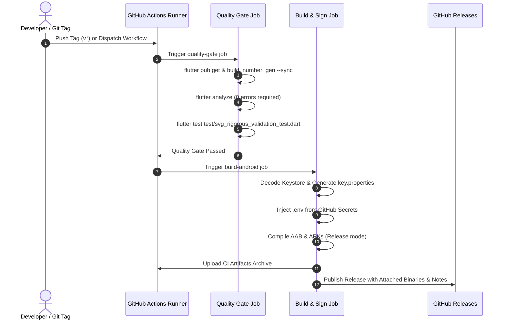

# Technical Specification & Operational Manual: Mobile Release Pipeline

**Standard Compliance**: IEC/IEEE 82079-1:2019 (Preparation of Information for Use of Products)  
**Document Identifier**: RR-ENG-SPEC-2026-003  
**System**: ReelRiot Mobile (Flutter / Android / iOS)  
**Document Version**: 1.0.0  
**Effective Date**: 2026-08-23  
**Author**: Engineering Team / DevOps  
**Classification**: Internal Technical Standard  

---

## 1. Scope and Purpose

### 1.1 Purpose
This document provides instructions and technical specifications for executing, configuring, and maintaining the automated release and continuous delivery pipeline for the ReelRiot Mobile application.

### 1.2 Scope
This standard covers:
1. Automated versioning and CalVer synchronization.
2. Local build pipeline execution via PowerShell automation (`tools/release.ps1`).
3. Continuous Integration and Continuous Deployment (CI/CD) workflows via GitHub Actions (`.github/workflows/release.yml`).
4. Cryptographic signing key management and environment variable reconstruction.
5. Quality gates, static analysis verification, and artifact distribution.

---

## 2. Target Audience and Required Competencies

This manual is intended for:
- **Mobile Application Engineers**: Familiar with Flutter, Dart, and Android build tools.
- **DevOps / Release Engineers**: Familiar with GitHub Actions, secret management, and store distribution tracks.
- **QA Engineers**: Responsible for binary verification, smoke testing, and artifact validation.

---

## 3. System Requirements and Prerequisites

| Component | Minimum Version | Recommended Version | Verification Command |
| :--- | :--- | :--- | :--- |
| **Flutter SDK** | 3.24.0 | 3.29.0+ (Stable channel) | `flutter --version` |
| **Dart SDK** | 3.5.0 | 3.7.0+ | `dart --version` |
| **Java JDK** | OpenJDK 17 | Eclipse Temurin 17 | `java -version` |
| **Android SDK** | API 24 (Android 7.0) | Target SDK API 34+ / Compile SDK 36 | `sdkmanager --list` |
| **PowerShell** | 5.1 (Windows) | 7.x (Cross-platform) | `$PSVersionTable.PSVersion` |
| **Git** | 2.30.0 | 2.40.0+ | `git --version` |

---

## 4. Security & Cryptographic Key Management

### 4.1 Android Release Keystore Generation
For production signing, generate an upload keystore if not already available:

```bash
keytool -genkey -v -keystore android/app/upload-keystore.jks \
  -storetype JKS -keyalg RSA -keysize 2048 -validity 10000 \
  -alias upload -storepass <STORE_PASSWORD> -keypass <KEY_PASSWORD>
```

> [!CAUTION]
> Never commit `upload-keystore.jks`, `key.properties`, or `.env` to the source control repository.

### 4.2 Encoding Keystore for CI/CD
Encode the binary keystore into a Base64 string for storage in GitHub Actions Secrets:

```powershell
# Windows PowerShell:
[Convert]::ToBase64String([IO.File]::ReadAllBytes("android\app\upload-keystore.jks")) | Set-Clipboard
```

```bash
# macOS / Linux:
base64 -i android/app/upload-keystore.jks | pbcopy
```

### 4.3 Required GitHub Actions Repository Secrets

Configure the following secrets in **Settings &rarr; Secrets and variables &rarr; Actions**:

| Secret Identifier | Description | Example / Format |
| :--- | :--- | :--- |
| `KEYSTORE_BASE64` | Base64-encoded `upload-keystore.jks` | `MIIKPQIBAzCCC...` |
| `STORE_PASSWORD` | Keystore storage password | String |
| `KEY_ALIAS` | Upload key alias | `upload` |
| `KEY_PASSWORD` | Key access password | String |
| `SUPABASE_URL` | Supabase endpoint URL | `https://*.supabase.co` |
| `SUPABASE_ANNON_KEY` | Supabase Public / Anon API Key | JWT string |
| `SUPABASE_SERVICE_ROLE_KEY` | Supabase Service Role Key | JWT string |
| `TMDB_API_KEY` | TheMovieDatabase v3 API Key | 32-character hex |
| `CAFFEINE_API_URL` | Caffeine video provider endpoint | URL |
| `CAFFEINE_API_KEY` | Caffeine authentication key | `caf_*` |
| `CONSUMET_URL` | Consumet provider gateway | URL |
| `MIXPANEL_API_KEY` | Mixpanel analytics project token | 32-character hex |
| `OPENSUBTITLES_API_KEY` | OpenSubtitles REST API key | Alphanumeric |
| `REVENUECAT_PUBLIC_SDK_KEY_ANDROID` | RevenueCat Android public key | `goog_*` |

---

## 5. Local Release Pipeline Execution

The repository provides [`tools/release.ps1`](file:///c:/Users/cnieves.wmg/Desktop/Projects/reelriot/tools/release.ps1) for standardized, reproducible local release builds.

### 5.1 Basic Execution Syntax

```powershell
# Build standard production artifacts (AAB + Universal APK + Split APKs)
.\tools\release.ps1 -Flavor prod -Target All

# Auto-bump build number and build production APKs
.\tools\release.ps1 -Flavor prod -Target Apk -BumpVersion

# Perform clean build of development flavor
.\tools\release.ps1 -Flavor dev -Clean -BumpVersion
```

### 5.2 Command Parameters

| Parameter | Type | Default | Description |
| :--- | :--- | :--- | :--- |
| `-Flavor` | String (`prod`, `dev`) | `prod` | Selects product flavor and entry point (`lib/main.dart` vs `lib/main_dev.dart`). |
| `-Target` | String (`All`, `AppBundle`, `Apk`, `SplitApk`) | `All` | Specifies output binary formats to compile. |
| `-BumpVersion` | Switch | `false` | Automatically increments build number and aligns CalVer date (`YYYY.MM.DD`). |
| `-Clean` | Switch | `false` | Executes `flutter clean` prior to dependency resolution. |
| `-SkipTests` | Switch | `false` | Bypasses `flutter analyze` and SVG test execution. |
| `-OutDir` | String | `build/outputs/releases` | Destination folder for final named artifacts. |

### 5.3 Output Artifact Naming Standard

Upon successful completion, artifacts are structured as follows:

```
build/outputs/releases/
├── ReelRiot-prod-2026.08.23_1715.aab                  (Google Play Store Bundle)
├── ReelRiot-prod-2026.08.23_1715-universal.apk        (Direct Install Universal APK)
├── ReelRiot-prod-2026.08.23_1715-arm64-v8a.apk        (64-bit ARM modern mobile devices)
├── ReelRiot-prod-2026.08.23_1715-armeabi-v7a.apk      (32-bit legacy mobile devices)
└── ReelRiot-prod-2026.08.23_1715-x86_64.apk           (Emulators & ChromeOS devices)
```

---

## 6. Continuous Integration & Deployment (CI/CD)

The GitHub Actions workflow is defined in [`.github/workflows/release.yml`](file:///c:/Users/cnieves.wmg/Desktop/Projects/reelriot/.github/workflows/release.yml).

### 6.1 Pipeline Workflow Stages



### 6.2 Manual Release Execution Model

The pipeline runs **strictly on manual dispatch** (`workflow_dispatch`) to give you full control over when releases are built, signed, and published:

| Parameter | Options | Default | Description |
| :--- | :--- | :--- | :--- |
| **`flavor`** | `prod`, `dev` | `prod` | Selects product flavor (`lib/main.dart` vs `lib/main_dev.dart`). |
| **`build_target`** | `all`, `appbundle`, `apk` | `all` | Selects binary formats to compile. |
| **`bump_build_number`** | `true`, `false` | `false` | When checked, automatically increments CalVer date & build number. |
| **`release_notes`** | String | `''` | Optional custom changelog notes to append. |

### 6.3 Triggering a Release from GitHub Actions

1. Go to your repository on GitHub: `https://github.com/Webcap/reelriot`
2. Click **Actions** &rarr; **ReelRiot Mobile Release Pipeline**.
3. Click **Run workflow** on the right, select your target branch (`main` or `development`), choose your flavor (`prod` or `dev`), and click **Run workflow**.

### 6.4 Automated GitHub Release Page Composition

When a release completes, GitHub Actions generates an official release page containing:
1. **CalVer Release Header**: Tagged automatically as `vYYYY.MM.DD+<buildNumber>`.
2. **Download Matrix**: Download links for Universal APK, ARM64-v8a, ARMv7, x86_64, and Play Store AAB.
3. **Automated Categorized Changelog**: Generated via `tools/changelog_gen.dart`.
4. **SHA-256 Checksums (`checksums.txt`)**: Cryptographic hashes for security verification.

### 6.5 Commit-Based Changelog Categorization Standard

The changelog generator parses git commits into categorized release sections using conventional commit conventions:

| Commit Prefix | Category Header | Example Message |
| :--- | :--- | :--- |
| `feat:`, `feat(*):`, `feature:` | **🚀 Features & Additions** | `feat: add VidSrc fallback provider` |
| `fix:`, `fix(*):`, `bugfix:` | **🐛 Bug Fixes** | `fix: resolve crash on null episode airDate` |
| `perf:`, `refactor:`, `ui:` | **⚡ Improvements & Optimizations** | `perf: tree-shake poppins fonts (-5MB)` |
| `chore:`, `ci:`, `build:` | **🔧 Maintenance & Infrastructure** | `ci: add automated release workflow` |
| Other commit formats | **📦 General Updates** | `Update translations and strings` |

### 6.6 Update Center Automated Synchronization

Upon publishing the GitHub Release, the pipeline automatically syncs release metadata to the **ReelRiot Update Center** (via Supabase / Caffeine API) using `tools/sync_update_center.dart`:
1. **Target Table**: `app_updates` (`platform`, `environment`, `latest_version`, `download_url`, `changelog`).
2. **History Log**: `app_update_history` (maintains deployment paper trail).
3. **In-App Delivery**: ReelRiot mobile clients querying `/v1/updates` immediately receive the new version prompt and direct APK download URL without any manual database edits.

---

## 7. Quality Assurance & Artifact Verification Checklist

Prior to public deployment to app stores, verify:

- [ ] **Package Analysis**: Verify `flutter analyze` reports zero errors and zero warnings.
- [ ] **Asset Integrity**: Run `flutter test test/svg_rigorous_validation_test.dart` to ensure no corrupted vector assets.
- [ ] **Cryptographic Signature**:
  ```bash
  apksigner verify --verbose dist/app-prod-release.apk
  ```
- [ ] **App Bundle Validation**:
  ```bash
  bundletool build-apks --bundle=dist/app-prod-release.aab --output=test.apks --mode=universal
  ```
- [ ] **SHA-256 Checksum Validation**: Ensure SHA256 hashes generated during the build match published checksum records.

---

## 8. Document History and Revision Log

| Revision | Date | Author | Summary of Changes |
| :--- | :--- | :--- | :--- |
| **1.0.0** | 2026-08-23 | Engineering Team | Initial specification under IEC/IEEE 82079-1 standard. |
