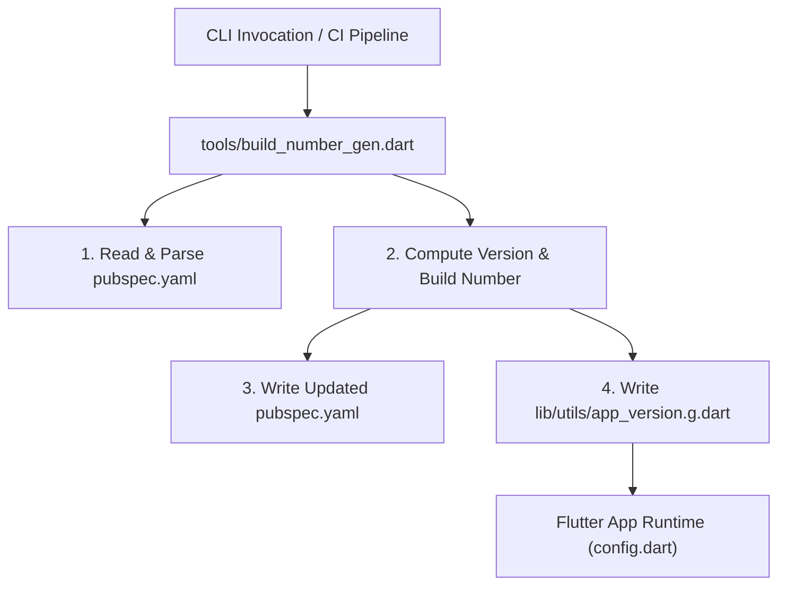

# Technical Product Documentation: ReelRiot Mobile Build Number & Version Generator

**Standard:** IEC/IEEE 82079-1 Edition 2.0 (Preparation of Information for Use of Products)  
**Document Identifier:** RR-DOC-ENG-2026-001  
**Version:** 1.0.0  
**Effective Date:** 2026-08-22  
**Classification:** Technical / Engineering Guide  
**Target Audience:** Mobile Software Engineers, Release Engineers, CI/CD Maintainers  

---

## 1. Document Overview & Scope

### 1.1 Purpose
This document provides instructions for use, functional specifications, configuration guidelines, and maintenance procedures for the **ReelRiot Mobile Build Number and Version Generator Tool** (`tools/build_number_gen.dart`).

### 1.2 Scope
This manual applies to the ReelRiot Flutter client codebase (`reelriot`), covering automated version string generation, build number increments, Git integration, timestamp generation, and synchronization with the Dart runtime configuration.

### 1.3 Target Audience and Prerequisites
Users of this document must possess:
- Basic proficiency with Dart SDK (`>=3.0.0 <4.0.0`) and Flutter tooling.
- Knowledge of Semantic Versioning (SemVer) and Calendar Versioning (CalVer).
- Working familiarity with Git version control systems and command-line interfaces.

---

## 2. Safety and Operational Warnings

> [!IMPORTANT]
> **Source Control Integrity**  
> Running the tool in standard mode modifies `pubspec.yaml` and `lib/utils/app_version.g.dart`. Ensure working tree changes are committed or stashed prior to automated release execution.

> [!WARNING]
> **Store Submissions (Google Play / Apple App Store)**  
> Build numbers MUST strictly monotonically increase for app store uploads. Using `--git` or `--timestamp` must be aligned with prior releases to prevent rejected submissions due to lower version codes.

> [!CAUTION]
> **Direct Modification of Generated Files**  
> Do NOT manually edit `lib/utils/app_version.g.dart`. Any manual modifications will be overwritten on subsequent tool invocations.

---

## 3. Product & Architectural Description

### 3.1 Component Architecture
The Version Generator coordinates three core components:



### 3.2 File Relationships

| File Path | Role / Description | Format |
| :--- | :--- | :--- |
| `tools/build_number_gen.dart` | Primary execution script and CLI parser | Dart Executable |
| `tools/version_gen.dart` | Backward-compatibility wrapper | Dart Script |
| `pubspec.yaml` | Primary manifest containing `version: <name>+<build>` | YAML |
| `lib/utils/app_version.g.dart` | Compile-time constant `currentAppVersion` | Dart Part File |
| `lib/utils/config.dart` | Consumes `currentAppVersion` via `part 'app_version.g.dart'` | Dart Library |

---

## 4. Technical Specifications & Requirements

### 4.1 System Requirements
- **Operating System:** Cross-platform (Windows 10/11, macOS, Linux).
- **Dart Runtime:** Dart SDK Version `>=3.0.0 <4.0.0` (bundled with Flutter).
- **Optional Dependencies:** Git CLI (required only when using the `--git` flag).

### 4.2 Versioning Format
The system enforces the standard Flutter version schema:
$$\text{Version} = \text{VersionName} + \text{BuildNumber}$$

- **VersionName (Default):** Calendar Versioning (`YYYY.MM.DD`) e.g., `2026.08.22`.
- **BuildNumber (Default):** Monotonically increasing positive integer e.g., `1714`.

---

## 5. Operating Instructions (Step-by-Step)

### 5.1 Verification Before Execution
Open a terminal in the root directory of the `reelriot` project:
```bash
# Verify current configured version
dart run tools/build_number_gen.dart --dry-run
```

### 5.2 Operating Procedures

#### Procedure A: Daily Release / Standard Incremental Build
Updates the version date to today and increments the build number by +1.
```bash
dart run tools/build_number_gen.dart
```

#### Procedure B: Git-Synchronized Build (CI/CD Pipelines)
Extracts the total commit count from `HEAD` and sets it as the build code:
```bash
dart run tools/build_number_gen.dart --git
```

#### Procedure C: Timestamp-Based Build
Generates a 10-digit timestamp format (`YYMMddHHmm`):
```bash
dart run tools/build_number_gen.dart --timestamp
```

#### Procedure D: Explicit Custom Version Assignment
Explicitly specifies version name and build number:
```bash
dart run tools/build_number_gen.dart --version 2026.09.01 --build 1800
```

#### Procedure E: Retain Existing Version Name (Build Bump Only)
Preserves the current date / version name while bumping the build number:
```bash
dart run tools/build_number_gen.dart --no-date
```

#### Procedure F: Code Synchronization Only
Synchronizes `pubspec.yaml` into `lib/utils/app_version.g.dart` without altering version numbers:
```bash
dart run tools/build_number_gen.dart --sync
```

---

## 6. Command Reference

| Flag / Option | Shorthand | Type | Description |
| :--- | :--- | :--- | :--- |
| `--help` | `-h` | Boolean | Displays usage information and exit codes. |
| `--dry-run` | — | Boolean | Simulates execution without modifying disk files. |
| `--sync` | `--sync-only`| Boolean | Updates `app_version.g.dart` to match `pubspec.yaml`. |
| `--no-date` | — | Boolean | Retains current version name; disables CalVer auto-update. |
| `--git` | — | Boolean | Computes build number via `git rev-list --count HEAD`. |
| `--timestamp` | — | Boolean | Computes build number using `DateTime.now()` (`YYMMddHHmm`). |
| `--version` | `-v` | String | Sets explicit version string (e.g. `2.1.0`). |
| `--build` | `-b` | Integer | Sets explicit build number integer (e.g. `1750`). |

---

## 7. Troubleshooting & Error Resolution

| Error Message / Symptom | Probable Cause | Corrective Action |
| :--- | :--- | :--- |
| `Error: pubspec.yaml not found.` | Command was run from a subdirectory. | Ensure the working directory is the project root (`reelriot/`). |
| `Error: Could not find valid "version:" entry` | Malformed or missing `version:` key in `pubspec.yaml`. | Verify `pubspec.yaml` contains `version: X.X.X+X` under the package header. |
| Git commit count falls back to +1 | `git` is not installed or current folder is not a Git repository. | Ensure Git is on `PATH` or use standard increment without `--git`. |
| App version not updated in UI | Missing generated file synchronization. | Run `dart run tools/build_number_gen.dart --sync` and perform a clean rebuild (`flutter clean && flutter run`). |

---

## 8. Verification & Quality Assurance

To verify correctness after execution:
1. Inspect `pubspec.yaml`:
   ```yaml
   version: 2026.08.22+1714
   ```
2. Inspect `lib/utils/app_version.g.dart`:
   ```dart
   // Generated by tools/build_number_gen.dart – do not edit.
   part of 'config.dart';

   const String currentAppVersion = '2026.08.22+1714';
   ```
3. Run test execution:
   ```bash
   dart analyze tools/build_number_gen.dart
   ```

---

## 9. Document History & Approval

| Version | Date | Author | Description of Change |
| :--- | :--- | :--- | :--- |
| 1.0.0 | 2026-08-22 | ReelRiot Engineering | Initial release under IEC/IEEE 82079-1 standard format. |
